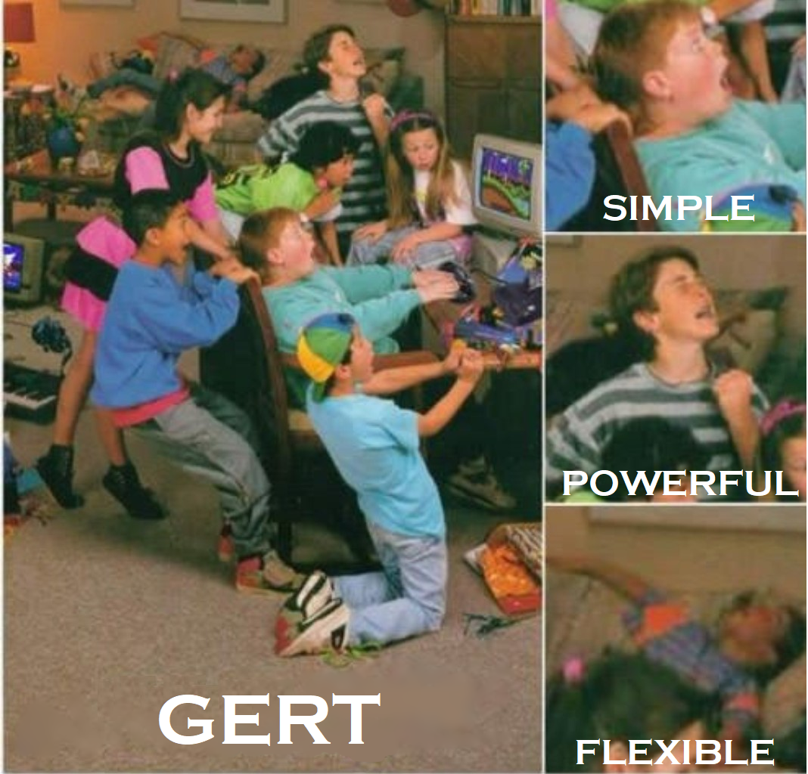

# Globally Engineered Routing Technology
Home of the GERT networking technology.

For networking within a Minecraft server, please use GERTi. For networking across the Internet and Minecraft servers, please use GERTe (and GERTi if needed).
For help with the software, please consult the wiki, MajGenRelativity#4971 on Discord, or MajGenRelativity on irc.esper.net